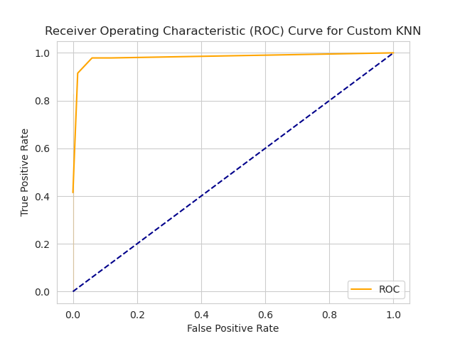
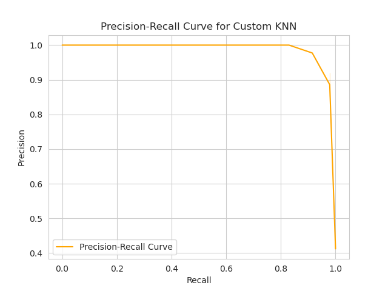
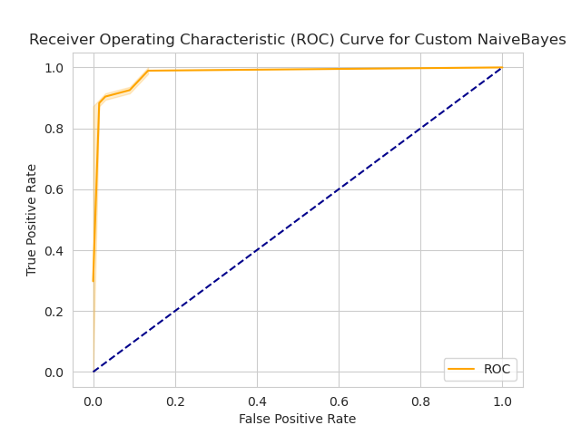
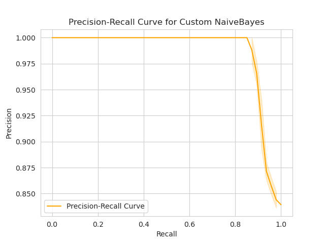
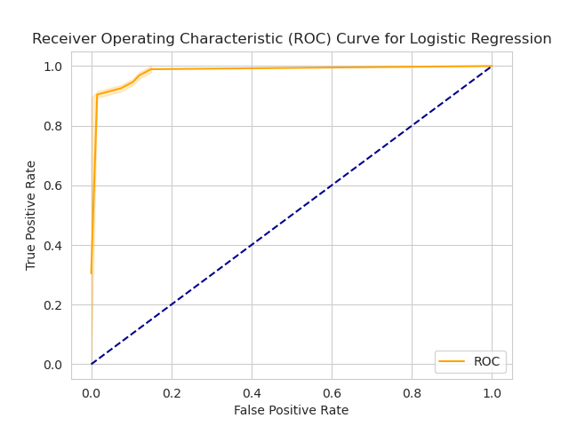
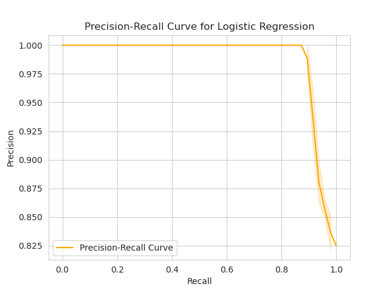
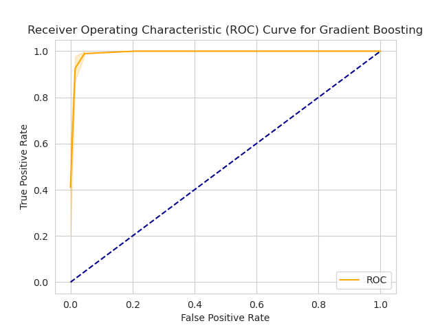
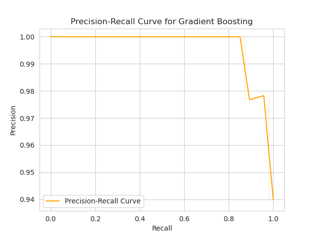
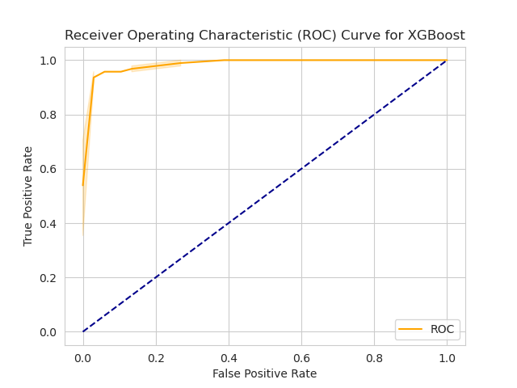
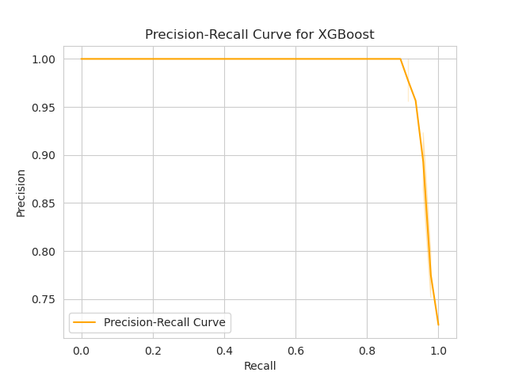

# Cancer Classification Report

## Evaluation Metrics
| Model | Accuracy | Precision | Recall | F1 Score | Training Time |
|-------|----------|-----------|--------|----------|---------------|
| Custom KNN | 0.9561 | 0.9773 | 0.9149 | 0.9451 | 0.0020 |
| Custom NaiveBayes | 0.9298 | 0.9149 | 0.9149 | 0.9149 | 0.0024 |
| Logistic Regression | 0.9561 | 1.0000 | 0.8936 | 0.9438 | 0.0049 |
| Gradient Boosting | 0.9825 | 0.9787 | 0.9787 | 0.9787 | 0.0268 |
| XGBoost | 0.9561 | 0.9565 | 0.9362 | 0.9462 | 0.0206 |

## Cross-Validation Scores

| Model | Cross-Validation Score |
|-------|-----------------------|
| Custom KNN | 0.9491 (+/- 0.0380) |
| Custom NaiveBayes | 0.9332 (+/- 0.0291) |
| Logistic Regression | 0.9367 (+/- 0.0274) |
| Gradient Boosting | 0.9404 (+/- 0.0353) |
| XGBoost | 0.9561 (+/- 0.0335) |

---
## Classification Reports

### **Custom KNN**

Best Params for Custom KNN model:
- {'feature_selection__k': 8, 'pca__n_components': 5}

### **Custom NaiveBayes**

### Best Params for Custom NaiveBayes model

- {'feature_selection__k': 7, 'pca__n_components': 3}

### **Logistic Regression**
### Best Params for Logistic Regression model
- {'classifier__C': 0.02, 'classifier__penalty': 'l2', 'feature_selection__k': 10, 'pca__n_components': 4}

### **Gradient Boosting**
### Best Params for Gradient Boosting model

- {'classifier__learning_rate': 1, 'classifier__n_estimators': 20, 'feature_selection__k': 7, 'pca__n_components': 6}

### **XGBoost**

### Best Params for XGBoost model

- {'classifier__learning_rate': 0.2, 'classifier__max_depth': 5, 'classifier__n_estimators': 20, 'feature_selection__k': 7, 'pca__n_components': 5}

